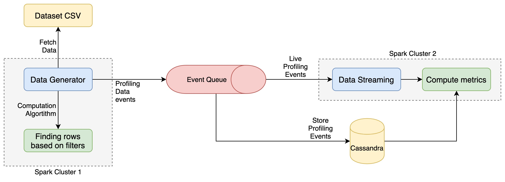

# 2020_group_06_s4210875_s4199456_s4208110

## Monitoring Spark

The goal of this project is to monitor the load on a Spark cluster and perform different types of profiling, and thus determining the bottlenecks and the performance of different algorithms.

### Architecture

The above image summarizes the architecture followed in the project. Going by details :

* The data set from [Congressional Voting Records](https://www.kaggle.com/devvret/congressional-voting-records) is taken. It has a total of 17 columns for each row. Original dataset has only 435 rows. But it is too less. Thus, we exploit the fact that all the columns have only 3 possible values, and use a random generator to in the script `generate_data.py` to generate more of such rows to enhance our dataset.

* This data is then fed in `data_generator`. The aim of this part of the project is to run random queries on out `Congressional Voting Records` data, and fetch results. We monitor certain aspects of these results, like the `start_time` for the query, `time_taken` to fetch the results and `no_of_records` fetched for each query, and publish an event in the RabbitMQ.

* These events published to `RabbitMQ` constitute the actual data set over which our monitoring spark cluster runs.

* In the package `metrics_computer`, we consume and unmarshal these events. They are used for both, batched processing and stream processing. We first store these events in a `Cassandra` database, and then feed them to a spark cluster ffor live processing.

* Describe batch processing algorithm

* Describe stream processing algorithm

### Dependencies

The project uses the following technological stack :

* [Python 3.7](https://www.python.org/downloads/release/python-370/)
* [Docker](https://www.docker.com/)
* [Pyspark 2.4.5](https://spark.apache.org/docs/latest/)
* [Pika 1.1.0](https://github.com/pika/pika)
* [RabbitMQ 3.8.3-rc.1](https://github.com/rabbitmq/rabbitmq-server/releases/tag/v3.8.3-rc.1)
* [Cassandra 3.11.6](http://cassandra.apache.org/)
* [Python-Cassandra-Driver 3.22.0](https://docs.datastax.com/en/developer/python-driver/3.22/)

### Running the program

* To run `docker-compose up`

* To run in detached mode `docker-compose up -d`

* To see the logs of a specific, container, first find the container name by running `docker ps -a`, then run `docker container logs <container_name>`.

* To see the network details in which all the containers of this project are running, first find the network name from `docker network ls`, then run `docker network inspect <network_name>`.

* To clean up `docker-compose down -v --rmi all --remove-orphans`.

* We can run separate container by `docker-compose up <container_name>` where `container_name` is one of the service names from the `docker-compose.yml`.

* While the containers are running, we can monitor the queue on the dashboard http://localhost:15672/ with [Username/Password] as `[guest/guest]`.

* The cassandra seed node exports port `9042` for running `CQL` queries. Thus, we can connect to `localhost:9042` and run any `cqlsh` query, and monitor the data in `cassandra` DB.

* Cassandra nodes can also be monitored by accessing any node using `docker exec -t <container_name> bash`, and running `nodetool status` commands.

* We have set up a `portainer` instance to be able to monitor the high level status of all the containers. We can access the Web UI for the same on http://localhost:10001/ while the portainer container is running.

